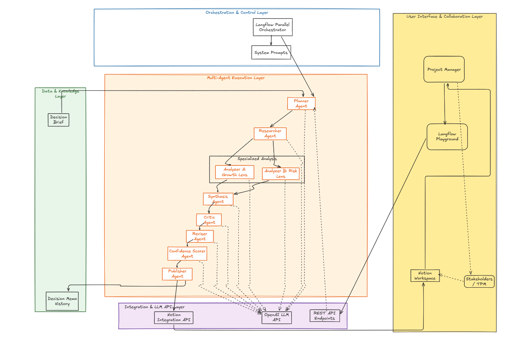

# Multi agent_Decision-flow ( Parallel Orchestration )
This is a simple multi agent orchestration demonstrating advantages of Multi agent workflow, When to not use single agent and It's tradeoffs.

# Problem Statement
A Project Manager at Nova cart is planning to offload his decision making tasks to a single agent. Ex: He wants to select a cloud warehouse vendor. In this scenario he would need revenue impact modeling, architectural complexity etc. to make a decision on the same. Given a **Single agent** might seem capable of all these tasks, When we overload a single agent with too many tasks, It results in vague outputs, **introduce hallucinations and reduce the trustworthiness of the suggested outputs.**

# Goal 
Build a well structured multi agent workflow to help with Project Manager's decision making tasks. Enabling faster but deeply researched and well analyzed decisions from both a Customer centric lens and Revenue risk lens. The final decision suggested should be critiqued for any gaps and provide a concrete roadmap to the Project Manager.

# Solution
We will be using the **Langflow** platform for this orchestration and each agent will use an Open AI LLM model and well crafted system prompts to analyze a **Decision Brief** and Publish a **Decision Memo** . We will also push this to a Notion Workspace that allows PM/TPM to collaborate and gather feedback from multiple stakeholders before making the final decision.

Each Agent will handle specific tasks and pass on the output to the subsequent agent in the flow. 

The workflow image illustrates the sequential pipeline combined with parallel lenses (Analyzer A & B) and a critic/revision loop.

1.**Planner Agent** - Task decomposition , set decision criteria based on the use case/decision brief provided by user. The Planner separates the planning stage from research and analysis. 

2. **Researcher Agent** - Based on the user input and Planner's output , gathers fact, lists out - assumptions, unknowns and risks. The Researcher isolates knowledge extraction. It prevents the downstream Analyzer from 
inventing facts. This agent is crucial for controlling hallucinations

3. **Analyzer Agent** - Based on the researcher's list deeps dive and analyzes the decision brief from both aspects - Customer lens and Risk lens. Highlights the Timelines , Risk and owners. The Analyzer is the decision maker. It cannot invent metrics; if information is missing it must suggest what to measure. At this stage you can already produce a reasonable memo, but you don’t yet have a critic or confidence score. One analyzer can miss things because it thinks from a single perspective. 
                Here we create two analyzers that look at the same decision in two different ways: 

                 ● Analyzer A: Customer / Revenue / Growth lens 

                 ● Analyzer B: Risk / Reliability / Privacy / Execution lens

5. **Synthesis Agent** - Gathers findings(both Customer and Risk lens) from the analyzer and provides one final memo by merging both perspectives. Synthesis Agent **must resolve conflicts, not just combine text.**

6. **Critic Agent( Red Team reviewer + Escalation Flag )** - Critiques the Decision memos for missing info, hallucinations and gaps in the suggested decision memo. So that Project Manager is aware of risks and tangents that needs more attention before making the final decision. —It does not rewrite the memo

7. **Reviser Agent** - Based on the Draft memo and critic feedback the Reviser agent would provide a cleaner memo ; Missing items would be moved into Assumptions/Unknowns; Clearer mitigations + stronger next steps and ESCALATE decision updated if needed.

8. **Confidence Scorer Agent** - This Agent Scores the Revised Memo between 0-100. Along with the reasoning for justifying the score and What can be done to increase the score. In general if there is lack of data , or key constraints lack evidence then the score would be lower.

9. **Publisher Agent** - Provides a Clean Final Decision Memo along with a Confidence Score and reasoning.

A copy of the Publisher's Output is pasted to the Notion Page configured. We can share the Notion page with stakeholders for async review.

# System Design 

# Sample Test 

**Decision Brief (input)**
 
 Vendor Selection :

 NovaCart needs to select a cloud data warehouse for its analytics platform. Current Redshift cluster costs $18K/month and query performance degrades during peak hours. 
 Options: (A) Migrate to Snowflake ($22K/month estimated, better concurrency), 
          (B) Migrate to BigQuery (pay-per-query, estimated $15K-25K/month), 
          (C) Optimize existing Redshift with RA3 nodes ($20K/month).
 
 Data volume is 14TB growing 2TB/quarter. 12 analysts and 3 data engineers are daily users. Migration timeline constraint: must complete before Q4 planning cycle.  No POC has been run on Snowflake or BigQuery. Security review for cross-cloud data transfer is pending. 

 **Decision Memo (output)**
 
 
 
# Setup Instructions

# Scaling_Strategy

Full implementation templates and production scaling strategies are maintained in a private repository; access for technical review is available upon request.

